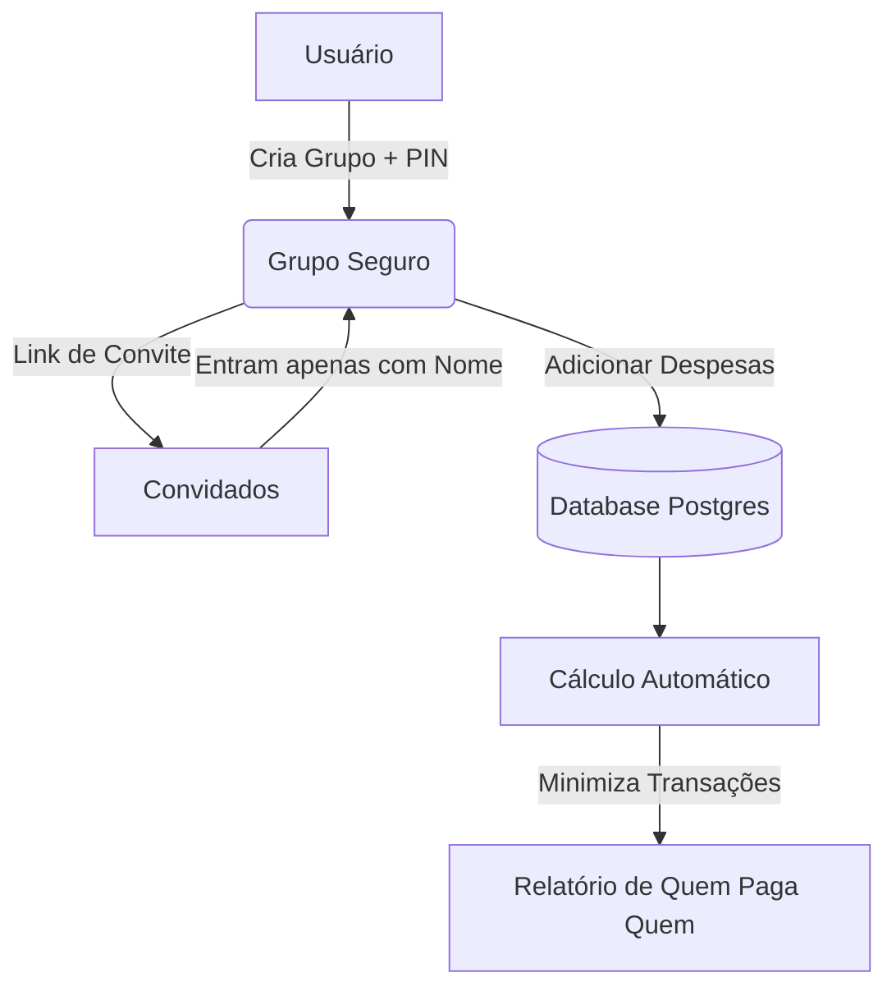

# Racha AI - Divisão de Contas Simplificada


Aplicação web fullstack para divisão de despesas entre amigos, focada em simplicidade e privacidade.

## 📊 Fluxo de Funcionamento



## 🚀 Funcionalidades

- **Sem Login/Email:** Acesso via Link e PIN de 4 dígitos.
- **Divisão Justa:** Algoritmo inteligente que minimiza transações.
- **Admin do Grupo:** Quem cria tem poderes de resetar senhas e remover usuários.
- **Moeda BRL:** Formatação automática para Real.
- **Mobile First:** Interface responsiva e com Dark Mode.

## 🛠️ Tecnologias

- **Frontend:** Next.js 14 (App Router), React, Tailwind CSS.
- **Backend:** Next.js Server Actions.
- **Database:** SQLite (Local) ou PostgreSQL (Supabase/Prod) com Prisma ORM.

## 📦 Instalação e Execução

1. Instale as dependências:
   ```bash
   npm install
   ```

2. Configuração do Banco de Dados (Escolha um):

   **Opção A: SQLite (Recomendado para rodar localmente)**
   
   Certifique-se que seu `prisma/schema.prisma` está configurado assim:
   ```prisma
    // datasource db {
    //   provider = "postgresql"
    //   url      = env("DATABASE_URL")
    // }

    datasource db {
      provider = "sqlite"
      url      = "file:./dev.db"
    }
   ```
   *Não é necessário configurar variáveis de ambiente complexas.*

   **Opção B: PostgreSQL / Supabase**
   
   Configure o `prisma/schema.prisma` para usar o provider `postgresql` e defina a variável `DATABASE_URL` no seu arquivo `.env`.

3. Crie o Banco de Dados:
   ```bash
   npx prisma db push
   ```

4. Geração do Cliente Prisma:
   ```bash
   npx prisma generate
   ```

5. Rodar em Desenvolvimento:
   ```bash
   npm run dev
   ```

Acesse [http://localhost:3000](http://localhost:3000).

## 🧪 Testes

Para validar a lógica de cálculo de saldos:

```bash
npm test
```

## 🧹 Manutenção Automatizada

O projeto inclui um script para limpeza de grupos inativos (sem atualizações há mais de 30 dias). Pode ser agendado via Cron.

```bash
node scripts/cleanup.js
```

## ⚡ Disclaimer

Este projeto foi integralmente **vibecoded**. 
Desenvolvido através de fluxo natural de prompts e colaboração IA + Humano, priorizando a velocidade e a experiência do usuário.


## 📝 Licença

MIT

## 📌 Todo List

- [ ] Adicionar testes de regressão visual.
